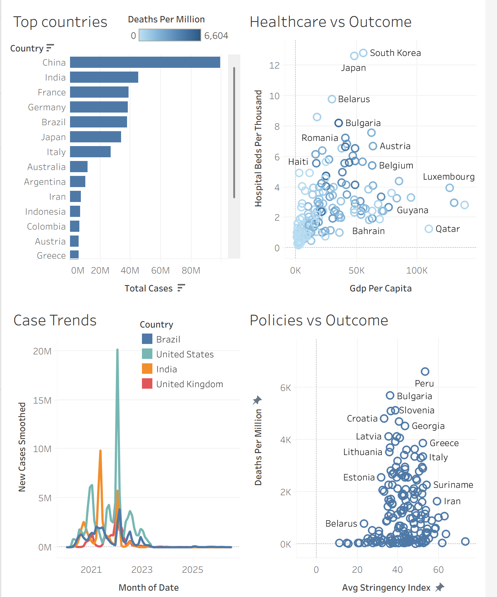

# COVID-19 Global Analysis 🌍

## 📌 About the Project

This is my **first data analytics portfolio project**, created as part of my learning journey through the **Google Data Analytics Professional Certificate on Coursera**.

In this project, I explored global COVID-19 data to understand the spread of the pandemic, differences between countries, healthcare capacity, case trends, and policy-related outcomes.

The goal of this project was to practice the fundamentals of **data analysis, SQL, Tableau, and data visualization** using a real-world dataset.

---

## 🎯 Project Objectives

The main objectives of this project were to:

* Explore global COVID-19 data
* Compare COVID-19 cases across countries
* Analyze deaths per million
* Identify COVID-19 case trends over time
* Explore healthcare capacity across countries
* Examine the relationship between GDP per capita and hospital beds
* Explore policy-related factors and COVID-19 outcomes
* Present the analysis through a Tableau dashboard

---

## 🛠️ Tools & Technologies

* **SQL** – Data analysis and querying
* **Tableau** – Data visualization and dashboard creation
* **Data Analysis** – Exploring trends and relationships
* **Data Visualization** – Presenting insights clearly

---

## 📊 Dashboard Overview

I created a Tableau dashboard containing four main visualizations.

### 🌍 1. Top Countries

This visualization compares countries based on their total COVID-19 cases, while also showing deaths per million.

It helps provide an overview of how strongly different countries were affected by COVID-19.

### 🏥 2. Healthcare vs Outcome

This scatter plot compares **GDP per capita** with **hospital beds per thousand people** across countries.

The purpose is to explore differences in economic conditions and healthcare capacity and how they relate to COVID-19 outcomes.

### 📈 3. Case Trends

This visualization shows changes in **new COVID-19 cases over time** for selected countries, including:

* Brazil
* United States
* India
* United Kingdom

It helps identify major increases and decreases in COVID-19 cases throughout the pandemic.

### 🏛️ 4. Policies vs Outcome

This visualization explores the relationship between policy-related factors and **deaths per million** across countries.

It provides an opportunity to compare countries and explore differences in COVID-19 outcomes.

---

## 💡 What I Learned

Through this project, I practiced:

* Working with a real-world dataset
* Writing SQL queries
* Exploring and analyzing data
* Identifying trends and patterns
* Creating visualizations in Tableau
* Building a dashboard
* Communicating data-driven observations
* Presenting analytical findings clearly

---

## 📈 Tableau Dashboard

---
---

## 📊 Tableau Dashboard

Explore the interactive Tableau dashboard:

👉 [View Interactive Dashboard on Tableau Public](https://public.tableau.com/views/COVID-19GlobalAnalysis-SpreadHealthcareCapacityandPolicyResponse/COVID-19SpreadHealthcareCapacityandPolicyResponse_?:language=en-US&:sid=&:redirect=auth&:display_count=n&:origin=viz_share_link)

The dashboard presents global COVID-19 trends, country comparisons, healthcare capacity, and policy-related outcomes.

## 🚀 Future Improvements

As I continue developing my data analytics skills, I plan to improve this project by:

* Adding more detailed analysis
* Exploring additional variables
* Improving dashboard interactivity
* Adding more data-driven insights
* Applying more advanced SQL techniques

---

## 📚 Learning Journey

This project is part of my journey toward becoming a **Data Analyst**.

I am currently building my skills in:

**SQL | Tableau | Excel | Data Analysis | Data Visualization**

---

## 👨‍💻 About Me

**Shivansh Jaiswal**

Aspiring Data Analyst | Fresher

Currently developing practical data analytics skills through projects and the **Google Data Analytics Professional Certificate**.

---

⭐ *This is my first data analytics portfolio project, and I look forward to building more projects as I continue learning.*
